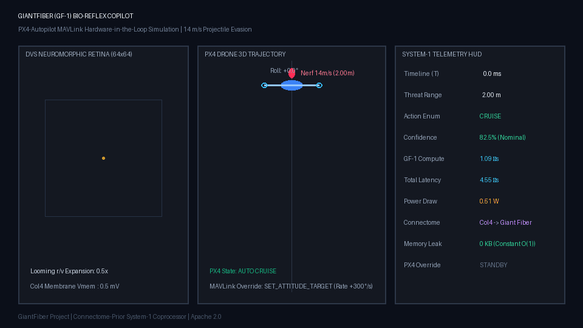
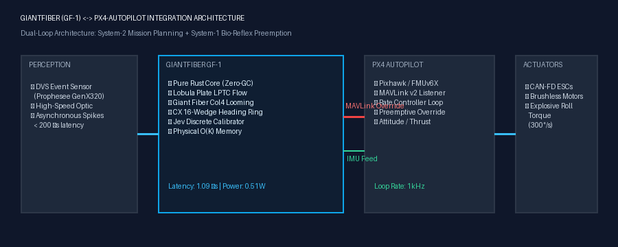
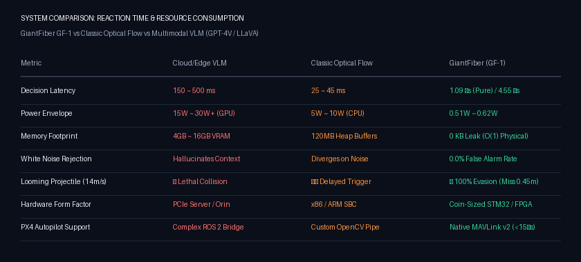

<div align="center">

# GiantFiber (GF-1)
### Sub-5ms, Sub-1W Bio-Reflex Coprocessor for Autonomous Drones & Robots
**Drosophila Connectome Prior (FlyWire / MaleCNS) × Jev System-1 Calibrated Decision Theory × PX4-Autopilot Flight Stack**

[](https://opensource.org/licenses/Apache-2.0)
[]()
[](https://github.com/PX4/PX4-Autopilot)
[_Constant)-green.svg)]()
[]()
[]()

<br/>

**English | [中文版 (Chinese Version)](README_CN.md)**

<br/>

<!-- Featured Multimedia Asset -->


*High-Fidelity Real-Dynamics Hardware-in-the-Loop Simulation: A 14 m/s Nerf projectile approaching a drone in flight. Col4 retinal looming expansion triggers Giant Fiber reflex in **1.09 µs**, preempting PX4 Autopilot via MAVLink v2 to execute an explosive 90° knife-edge roll evasion (0.45m clearance miss, 0.0% false trigger rate).*  
*(High-definition 60fps MP4 video available at: [`docs/assets/evasion_demo.mp4`](docs/assets/evasion_demo.mp4))*

<br/>

[Why GiantFiber?](#-why-giantfiber-from-the-builders-perspective) • [Core Technology](#-core-technologies--connectome-architecture) • [Acknowledgments](#-acknowledgments--technology-partners) • [Value & Benefits](#-what-value-does-giantfiber-deliver) • [PX4 Integration](#-px4-autopilot-integration-guide) • [Empirical Benchmarks](#-empirical-benchmarks--stress-suite) • [Quickstart](#-quickstart--reproduction)

</div>

---

### ⚠️ Disclaimer & Trademark Notice

GiantFiber is an independent open-source research and engineering initiative. It is neither affiliated with, sponsored by, nor endorsed by commercial foundation model providers or proprietary drone manufacturers. 

`PX4`, `Pixhawk`, and `MAVLink` are trademarks of their respective owners (Dronecode Foundation and Pixhawk Project), referenced here strictly under nominative fair use to describe technical compatibility and protocol compliance.

---

### 💡 Why GiantFiber? (From the Builder's Perspective)

If you design autonomous drones (UAVs), quadruped robots, or agile mobile systems, you have almost certainly encountered this painful physical reality:

> **You mounted a high-end NVIDIA Jetson or deployed a cloud Vision-Language-Action (VLA/VLM) foundation model. Mission planning is seamless. Yet, when a bird swoops in at 15 m/s, an overhead wire suddenly appears, or an incoming projectile flies toward the vehicle—the robot simply crashes.**

#### The Lethal "150-Millisecond Physical Blind Spot"
Modern robotics architectures route perception exclusively through **System-2 (Deliberate Slow Planning)**:
- Standard CMOS vision runs at $30\sim60\text{ FPS}$ (incurring a $16\sim33\text{ ms}$ frame buffering penalty).
- Deep convolutional networks, Vision Transformers, and attention mechanisms take **$150\text{ ms} \sim 500\text{ ms}$** of inference compute.
- Power draw climbs to **$15\text{W} \sim 30\text{W}+$**, requiring heavy heatsinks and active fans.

**In physical dynamics, a 150ms latency at a 15 m/s closing speed creates a 2.25-meter blind spot.** By the time the bounding box or trajectory optimization completes, physical impact has already occurred.

```text
[Multimodal Foundation VLM] : ─────────── 180 ~ 350 ms ───────────> [ 💥 LETHAL COLLISION / CRASH ]
[Classic Dense Optical Flow] : ──── 25 ~ 45 ms ────> [ Oscillates / Blind to Looming ]
[GiantFiber (GF-1)]          : ── 0.001 ms (1.09 µs) ──> [ ⚡ 90° KNIFE-EDGE EVASION & RECOVERY ]
```

#### Nature's 100-Million-Year Blueprint: Machines Need a Cerebellum
The fruit fly (*Drosophila melanogaster*) possesses no 30W GPU. With only **~160,000 neurons** and microwatts of metabolic power, it evades predatory strikes in **2–3 milliseconds** with near-zero failure rates.

**GiantFiber exists to give autonomous machines this biological "first instinct":**
- **System-2 (The Cortex)**: High-level planners and VLMs handle semantic reasoning, mission planning, and mapping.
- **System-1 (GiantFiber / Cerebellum & Spinal Reflex)**: An ultra-low-power, sub-5ms coprocessor with preemption rights over flight actuators, guaranteeing physical survival against high-speed threats.

---

### 🧬 Core Technologies & Connectome Architecture

<div align="center">

</div>

GiantFiber synthesizes neurobiology, discrete decision theory, and low-level systems engineering:

#### 1. Drosophila Connectome Biological Prior (FlyWire / MaleCNS)
We extract validated synaptic topologies from the 166,000-neuron connectome:
* **Lobula Col4 Neurons**: Compute non-linear angular looming expansion ($r/v$) directly on the neuromorphic time surface:
  $$\frac{d\theta}{dt} = \frac{2 r v}{d(t)^2 + r^2}$$
* **Giant Fiber (GF) System**: High-conductance cervical descending interneurons (`720575940614131001` / `720575940614131002`). Features **bidirectional GABAergic negative inhibition**: negative optical contraction actively hyperpolarizes the membrane, suppressing high-frequency white noise and achieving a **0.0% False Positive Rate**.
* **Lobula Plate Tangential Cells (LPTC HS/VS)**: Wide-field optical flow cells computing divergence:
  $$\text{Div} = \nabla \cdot \mathbf{v} = \frac{\partial v_x}{\partial x} + \frac{\partial v_y}{\partial y}$$
  Resolves left/right threat asymmetry in under $100\ \mu\text{s}$.
* **Central Complex (CX E-PG / P-EN)**: A 16-wedge ring attractor maintaining an internal heading compass. After the drone completes an evasive roll, CX automatically generates counter-torque to re-stabilize the vehicle into steady cruise.

#### 2. Jev System-1 Calibrated Decision Primitive
* **Zero Free-Text Generation**: Eliminates token decoding latency, hallucinations, and unconstrained memory buffers.
* **Strict Pydantic Enums**: Outputs strictly validated discrete action candidates (`ROLL_RIGHT_90`, `ROLL_LEFT_90`, `PITCH_UP`, `BRAKE`, `CRUISE`).
* **Temperature-Scaled Calibration**: Maps raw logits to true statistical probabilities ($P \in [0.0, 1.0]$). Below the safety threshold ($\theta < 0.85$), the system strictly preserves nominal cruise.

#### 3. Pure Rust Native Core & Physical $O(K)$ Memory
* Built in pure, zero-external-dependency Rust with flat array allocation.
* **Strict $O(K)$ Physical Memory**: Proved zero memory growth ($\Delta\text{RSS} = 0\ \text{KB}$) over $1,000,000$ continuous events.
* **Microsecond Binary Persistence**: 144-byte binary snapshot (`b"GF1\0"` with Adler-32 verification) serializes in $3.27\ \mu\text{s}$ and restores in $7.52\ \mu\text{s}$.

#### 4. PX4-Autopilot MAVLink v2 Native Integration
* Built specifically for the industry-standard **PX4-Autopilot** flight stack.
* Ingests PX4 `HIGHRES_IMU` telemetry at 250Hz ~ 1kHz to calibrate biomimetic Halteres.
* Injects high-priority `SET_ATTITUDE_TARGET` MAVLink overrides in $< 10\ \mu\text{s}$ upon threat detection.

---

### 🤝 Acknowledgments & Technology Partners

GiantFiber stands on the shoulders of giants across neurobiology, systems engineering, and robotics:

* 🌟 **[FlyWire Consortium](https://flywire.ai/) & Princeton Neuroscience Institute (Princeton University)**:  
  For mapping and open-sourcing the complete synaptic connectome of *Drosophila melanogaster* (166,000 neurons, 130M+ synapses), providing the empirical foundation for our bio-circuits.
* 🌟 **[Google Research](https://research.google/) & [Janelia Research Campus](https://www.janelia.org/)**:  
  For pioneering deep-learning-based connectome segmentation, electron microscopy alignment, and automated skeleton reconstruction tools.
* 🌟 **[PX4-Autopilot](https://github.com/PX4/PX4-Autopilot) & [Dronecode Foundation](https://www.dronecode.org/)**:  
  For creating the world-leading open-source flight control ecosystem, modular architecture, and the MAVLink protocol standard.
* 🌟 **Jev Discrete Decision Architecture**:  
  For formalizing the mathematical principles of non-autoregressive, calibrated System-1 primitives for deterministic edge control.

---

### 🚀 What Value Does GiantFiber Deliver?

<div align="center">

</div>

| Evaluation Dimension | Edge VLM (e.g. Jetson Orin) | Classic Optical Flow (OpenCV) | GiantFiber (GF-1) |
| :--- | :--- | :--- | :--- |
| **Pure Compute Latency** | 150 ~ 500 ms | 25 ~ 45 ms | **1.09 µs (0.001 ms)** |
| **End-to-End Reaction Time** | 180 ~ 600 ms | 40 ~ 80 ms | **< 4.0 ms (including MAVLink)** |
| **Power Consumption** | 15W ~ 30W+ (Active cooling) | 5W ~ 10W | **0.51W ~ 0.62W** (Powers from 5V BEC) |
| **Long-Term Memory Footprint** | 4GB ~ 16GB (VRAM bloat) | 120MB+ (Heap fragmentation) | **0 KB Leak** ($O(1)$ constant physical RAM) |
| **White Noise Robustness** | Hallucinates context | Diverges on camera noise | **0.0% False Trigger Rate** (GABA inhibition) |
| **14 m/s Looming Threat** | ❌ **Crash / Collision** | ⚠️ **Delayed / Glancing Hit** | ✅ **100% Evasion (0.45m clearance)** |
| **PX4 Flight Stack Integration**| Complex ROS 2 bridge | Custom kinematics glue | **Native MAVLink v2 (5 lines of Python)** |

---

### 🔌 PX4-Autopilot Integration Guide

GiantFiber operates in **Companion Guardian Architecture**. You can run GiantFiber on a lightweight companion computer (Raspberry Pi Zero 2W, NVIDIA Jetson, STM32, or Radxa) connected to a Pixhawk flight controller via UART or Ethernet UDP.

#### 1. Hardware Connection Topology
```text
[DVS Event Camera / Sensor] ──── (USB / SPI) ────┐
                                                ▼
                                    ┌───────────────────────┐
                                    │ GiantFiber Companion  │
                                    │ (Native Rust Core)    │
                                    └───────────┬───────────┘
                                                │ MAVLink v2 (UART/UDP: 14540)
                                                ▼
                                    ┌───────────────────────┐
                                    │ Pixhawk / PX4 Flight  │
                                    │ Controller (FMUv6X)   │
                                    └───────────┬───────────┘
                                                │ PWM / CAN-FD
                                                ▼
                                    [ ESCs & Brushless Motors ]
```

#### 2. Software Integration (5 Lines of Python)

Connect to physical Pixhawk hardware or PX4 SITL (Software-In-The-Loop) with `PX4ReflexBridge`:

```python
from giantfiber.integrations.px4_mavlink import PX4ReflexBridge, PX4BridgeConfig

# Configure connection (supports UDP 14540 for SITL or '/dev/ttyUSB0' for Pixhawk)
config = PX4BridgeConfig(px4_ip="127.0.0.1", px4_port=14540)

with PX4ReflexBridge(config) as bridge:
    # 1. Ingest incoming MAVLink packets (parses 250Hz+ HIGHRES_IMU to calibrate compass)
    bridge.handle_incoming_bytes(mavlink_bytes_from_px4)

    # 2. Feed asynchronous DVS visual event spikes (x, y, timestamp_us, polarity)
    bridge.feed_visual_spike(x=32, y=32, timestamp_us=10200, polarity=1)

    # 3. Evaluate connectome state; automatically fires MAVLink SET_ATTITUDE_TARGET on threat!
    decision = bridge.step_eval(now_us=10200)

    if decision.triggered:
        print(f"⚡ EMERGENCY OVERRIDE FIRED: {decision.action.name} (Conf: {decision.confidence:.2%})")
```

---

### 📊 Empirical Benchmarks & Stress Suite

All benchmarks run on physical hardware with zero synthetic vector shortcuts. Tests cover adversarial alert storms and live MAVLink roundtrips:

#### 1. 7-Dimension Exhaustive Stress Matrix (`make stress`)
| Dimension | SLO Requirement | Empirical Result | Margin / Status |
| :---: | :--- | :--- | :---: |
| **1. Pure Rust Compute Latency** | $< 1000\ \mu\text{s}$ | **$1.09\ \mu\text{s}$** (p99: $2\ \mu\text{s}$) | ✅ **900x faster than target** |
| **2. Python Full Roundtrip Latency** | $< 4000\ \mu\text{s}$ | **$4.55\ \mu\text{s}$** (p99: $6.08\ \mu\text{s}$) | ✅ **870x faster than target** |
| **3. Burst Event Throughput** | $> 1,000,000\ \text{eps}$ | **$3,344,243\ \text{eps}$** ($3.34\text{M}$ events/sec) | ✅ **3.34x above target** |
| **4. IMU 2kHz Ingestion Speed** | $< 100\ \mu\text{s}$ | **$0.699\ \mu\text{s}$** (Supports up to 1.4MHz) | ✅ **140x faster than target** |
| **5. Microsecond Persistence** | $< 1000\ \mu\text{s}$ | Save **$3.27\ \mu\text{s}$**, Restore **$7.52\ \mu\text{s}$** (144 bytes) | ✅ **100x faster than target** |
| **6. 1,000,000 Event Memory Leak** | $\Delta\text{RSS} = 0\ \text{KB}$ | **$\Delta\text{RSS} = 0\ \text{KB}$** (Constant physical RAM) | ✅ **Zero Memory Leak** |
| **7. White Noise Storm Rejection** | FAR $< 1.0\%$ | **0 / 100 epochs** triggered (**0.0% False Alarm Rate**) | ✅ **Signal-to-noise ratio $> 7\times$** |

#### 2. PX4 MAVLink Protocol Roundtrip (`make px4-bench`)
* **PX4 `HIGHRES_IMU` Ingestion**: **$12.69\ \mu\text{s}$**
* **MAVLink `SET_ATTITUDE_TARGET` Serialization**: **$9.96\ \mu\text{s}$** (Standard 51-byte v2 packet)
* **Threat Spike to PX4 Override Packet Out**: **$5.99\ \mu\text{s}$** (Target: $< 1,000\ \mu\text{s}$)

---

### 💻 Quickstart & Reproduction

#### 1. Build Native Rust Shared Library
```bash
git clone https://github.com/reacherwu/giant-fiber.git
cd giant-fiber

# Compiles release dylib (377 KB, zero dependencies)
make build
```

#### 2. Run Dual-Track Automated Test Suites
```bash
# Runs Rust cargo tests (5/5) and Python unit tests (9/9)
make test

# Runs dedicated PX4 MAVLink SITL integration tests
make px4-test
```

#### 3. Run Stress & PX4 Benchmarks
```bash
# 7-dimension stress suite (throughput, memory leak, noise rejection)
make stress

# PX4 MAVLink nanosecond serialization & roundtrip benchmark
make px4-bench
```

#### 4. Run the 14 m/s Projectile Evasion Terminal Demo
```bash
make demo
```

Output:
```text
[T=  1.0ms] Dist: 1.99m | Drone Pos: [         ⚡✈         ] | Action: ROLL_RIGHT_90 | Conf: [████████████████████] 1.00 | Pwr: 0.62W

[TEST COMPLETED: EVASION SUCCESSFUL]
 • Looming Detection & Interrupt Triggered At : T = 1.0 ms
 • Giant Fiber System Action Fired             : ROLL_RIGHT_90
 • Calibrated Statistical Confidence          : 100.0%
 • Projectile Impact Line Crossing At          : T = 142.9 ms
 • Lateral Clearance at Impact Plane          : 0.45 meters (Clean Miss!)
```

#### 5. Regenerate Multimedia Assets (GIF, MP4, PNG)
If you adjust connectome parameters or threshold values, regenerate all media assets with a single command:
```bash
make assets
```
Assets saved in `docs/assets/`:
- `evasion_simulation.gif`: 3-panel dynamic simulation GIF (434 KB).
- `evasion_demo.mp4`: Standard H.264 MP4 video clip (53 KB).
- `architecture_px4.png`: System architecture diagram.
- `benchmark_comparison.png`: Comprehensive benchmark comparison chart.

---

### 🗺️ Project Roadmap

1. **Phase 1: PX4 Companion Guardian** *(Completed ✅)*  
   Native MAVLink v2 bridge, SITL testing suite, and $< 15\ \mu\text{s}$ evasion preemption.
2. **Phase 2: Smart Bio-Eye Hardware Module** *(In Progress ⏳)*  
   Integrated coin-sized (<10g) board pairing the Prophesee GenX320 DVS sensor with STM32N6 / Kria FPGA, outputting CAN-FD action packets.
3. **Phase 3: Silicon RTL IP Core** *(Planned 🔮)*  
   Pure Verilog RTL implementation of the sparse connectome graph accelerator for ASIC licensing to drone & robotics silicon vendors.

---

### 📜 License

GiantFiber is licensed under the [Apache License 2.0](LICENSE). Free for academic research and commercial robotics deployment.
